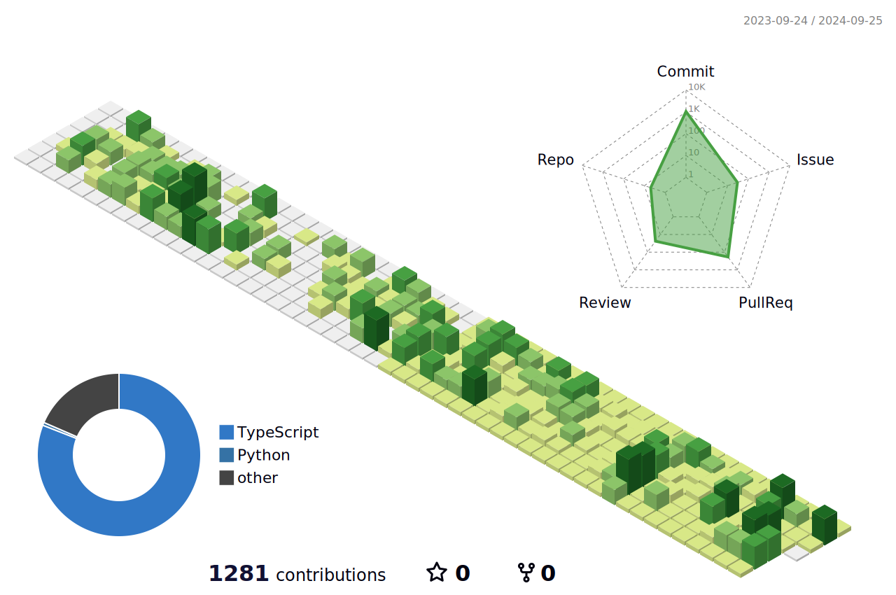

### 🤞 Nice way to meet me

  
  

  👋&nbsp; Hi there! I'm <b>FrontEnd developer</b> skilled in WEB.🚀 
  At present, I have been interested in React. 

### 💪 Skills
#### Platforms & Languages

  
  
  
  
  

